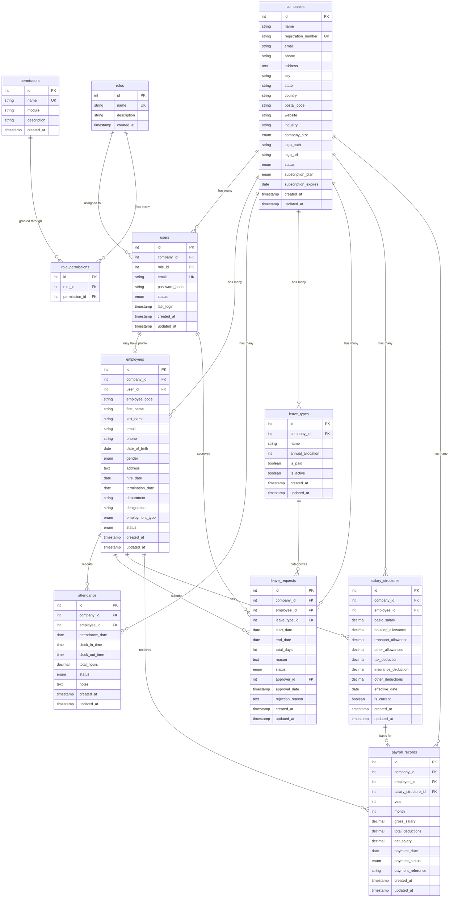

# Entity Relationship Diagram & Data Model

## Database ER Diagram

## Data Model Statistics

### Table Relationships Summary

| Table | Primary Relations | Foreign Keys | Indexes | Constraints |
|-------|------------------|--------------|---------|-------------|
| **companies** | Root entity | 0 | 3 | 2 unique |
| **roles** | Reference table | 0 | 1 | 1 unique |
| **permissions** | Reference table | 0 | 2 | 1 unique |
| **role_permissions** | Junction table | 2 | 1 | 1 unique composite |
| **users** | Tenant entity | 2 | 3 | 1 unique |
| **employees** | Core entity | 2 | 4 | 2 unique |
| **attendance** | Transaction table | 2 | 4 | 1 unique composite |
| **leave_types** | Configuration table | 1 | 2 | 1 unique composite |
| **leave_requests** | Transaction table | 4 | 6 | 0 |
| **salary_structures** | Configuration table | 2 | 5 | 0 |
| **payroll_records** | Transaction table | 3 | 5 | 1 unique composite |

### Data Volume Projections

| Table | Small Company (50 employees) | Medium Company (200 employees) | Large Company (1000 employees) |
|-------|------------------------------|--------------------------------|--------------------------------|
| **companies** | 1 record | 1 record | 1 record |
| **users** | 50 records | 200 records | 1,000 records |
| **employees** | 50 records | 200 records | 1,000 records |
| **attendance** | 18,250/year | 73,000/year | 365,000/year |
| **leave_requests** | 200/year | 800/year | 4,000/year |
| **salary_structures** | 50-100 records | 200-400 records | 1,000-2,000 records |
| **payroll_records** | 600/year | 2,400/year | 12,000/year |

### Storage Requirements

| Table | Record Size | Small Company | Medium Company | Large Company |
|-------|-------------|---------------|----------------|---------------|
| **companies** | 2KB | 2KB | 2KB | 2KB |
| **users** | 500 bytes | 25KB | 100KB | 500KB |
| **employees** | 1.5KB | 75KB | 300KB | 1.5MB |
| **attendance** | 300 bytes | 5.5MB/year | 22MB/year | 110MB/year |
| **leave_requests** | 800 bytes | 160KB/year | 640KB/year | 3.2MB/year |
| **salary_structures** | 400 bytes | 20-40KB | 80-160KB | 400-800KB |
| **payroll_records** | 600 bytes | 360KB/year | 1.4MB/year | 7.2MB/year |
| **Total Estimated** | - | 6MB/year | 24MB/year | 120MB/year |

## Data Integrity Constraints

### Primary Key Constraints
- **11 tables** with auto-incrementing integer primary keys
- **Unique identification** for all entities
- **Referential integrity** maintained across all relationships

### Foreign Key Constraints
- **15 foreign key relationships** ensuring data consistency
- **Cascade deletion** for tenant data (company → users → employees)
- **Restrict deletion** for reference data (roles, permissions, leave types)
- **Set null** for optional relationships (user_id in employees)

### Unique Constraints
- **8 unique constraints** preventing duplicate data
- **Composite unique keys** for business rules (employee_code per company)
- **Natural unique keys** for business identifiers (email, registration_number)

### Check Constraints
- **Month validation** in payroll_records (1-12)
- **ENUM constraints** for controlled vocabularies
- **Data type constraints** ensuring proper data formats

## Multi-Tenant Architecture

### Tenant Isolation Strategy
- **company_id** in all tenant-specific tables
- **Row-level security** through application middleware
- **Complete data separation** between companies
- **Cascade deletion** for clean tenant removal

### Tenant Tables (7 tables)
1. **users** - User accounts per company
2. **employees** - Employee profiles per company  
3. **attendance** - Daily attendance records per company
4. **leave_types** - Company-specific leave policies
5. **leave_requests** - Leave applications per company
6. **salary_structures** - Compensation plans per company
7. **payroll_records** - Monthly payroll per company

### Shared Reference Tables (4 tables)
1. **companies** - Tenant root entities
2. **roles** - System-wide user roles
3. **permissions** - System-wide permission definitions
4. **role_permissions** - Role-permission mappings

## Index Strategy

### Performance Indexes
| Table | Index Name | Columns | Purpose |
|-------|------------|---------|---------|
| **companies** | idx_companies_status | status | Filter active companies |
| **companies** | idx_companies_industry | industry | Group by industry |
| **users** | idx_users_company | company_id | Tenant queries |
| **users** | idx_users_status | status | Filter active users |
| **employees** | idx_employees_company | company_id | Tenant queries |
| **employees** | idx_employees_status | status | Filter active employees |
| **employees** | idx_employees_department | department | Department reports |
| **attendance** | idx_attendance_company | company_id | Tenant queries |
| **attendance** | idx_attendance_date | attendance_date | Date range queries |
| **attendance** | idx_attendance_status | status | Status filtering |
| **leave_requests** | idx_leave_requests_company | company_id | Tenant queries |
| **leave_requests** | idx_leave_requests_employee | employee_id | Employee history |
| **leave_requests** | idx_leave_requests_status | status | Status filtering |
| **leave_requests** | idx_leave_requests_dates | start_date, end_date | Date range queries |
| **payroll_records** | idx_payroll_company | company_id | Tenant queries |
| **payroll_records** | idx_payroll_period | year, month | Period queries |

### Composite Indexes (Recommended)
| Table | Suggested Index | Columns | Performance Gain |
|-------|----------------|---------|------------------|
| **employees** | idx_company_status_name | company_id, status, first_name, last_name | 50-70% |
| **attendance** | idx_company_date_employee | company_id, attendance_date, employee_id | 40-60% |
| **leave_requests** | idx_company_status_date | company_id, status, start_date | 30-50% |
| **payroll_records** | idx_company_period_employee | company_id, year, month, employee_id | 40-60% |

## Data Security & Compliance

### Sensitive Data Fields
| Table | Sensitive Fields | Protection Method |
|-------|-----------------|-------------------|
| **users** | password_hash | bcrypt hashing |
| **employees** | email, phone, address, date_of_birth | Input validation |
| **salary_structures** | All salary fields | Access control |
| **payroll_records** | All financial fields | Access control |

### Audit Trail
- **created_at** timestamp on all tables
- **updated_at** timestamp with auto-update
- **Immutable records** for payroll and attendance
- **Soft delete capability** for critical data

### GDPR Compliance Features
- **Data minimization** - only necessary fields collected
- **Purpose limitation** - clear data usage definitions
- **Storage limitation** - automatic retention policies possible
- **Data portability** - JSON export capability
- **Right to erasure** - cascade deletion support

This ER diagram and data model documentation provides a comprehensive view of the database structure, relationships, and capacity planning for the multi-tenant HRMS system.